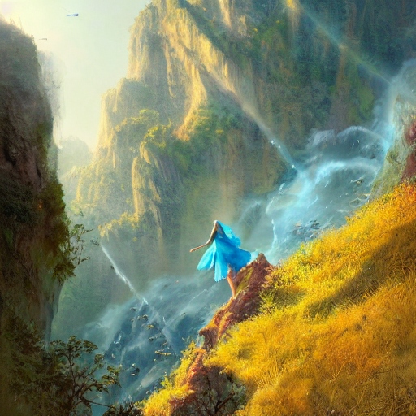
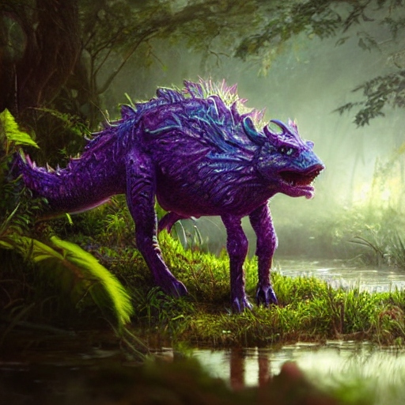
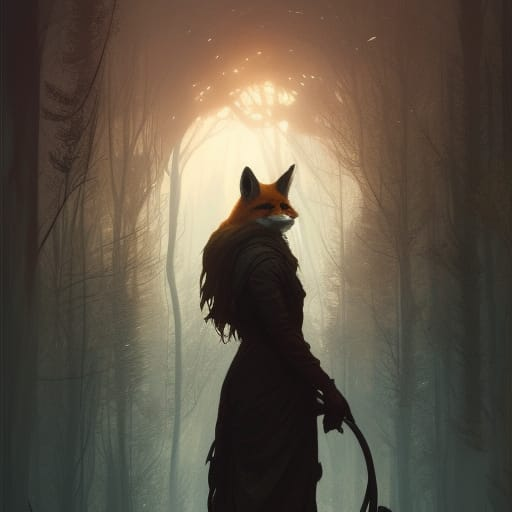

- [1. Welt](#1-welt)
  - [1.1. Vergangenheit: Der Zenit der schwarze Sonne](#11-vergangenheit-der-zenit-der-schwarze-sonne)
  - [1.2. Heute](#12-heute)
  - [1.3. Fraktionen](#13-fraktionen)
    - [1.3.1. Menschen](#131-menschen)
      - [1.3.1.1. Welt](#1311-welt)
      - [1.3.1.2. Lebensweise](#1312-lebensweise)
      - [1.3.1.3. Ingame Special](#1313-ingame-special)
    - [1.3.2. Feen](#132-feen)
      - [1.3.2.1. Volk](#1321-volk)
      - [1.3.2.2. Welt](#1322-welt)
      - [1.3.2.3. Lebensweise](#1323-lebensweise)
      - [1.3.2.4. Ingame Special](#1324-ingame-special)
    - [1.3.3. Gestaltenwandler](#133-gestaltenwandler)
      - [1.3.3.1. Volk](#1331-volk)
      - [1.3.3.2. Welt](#1332-welt)
      - [1.3.3.3. Lebensweise](#1333-lebensweise)
      - [1.3.3.4. Ingame Special](#1334-ingame-special)
    - [1.3.4. Zwerge](#134-zwerge)
      - [1.3.4.1. Volk](#1341-volk)
      - [1.3.4.2. Welt](#1342-welt)
      - [1.3.4.3. Lebensweise](#1343-lebensweise)
      - [1.3.4.4. Ingame Special](#1344-ingame-special)
    - [1.3.5. Das Wildvolk](#135-das-wildvolk)
      - [1.3.5.1. Volk](#1351-volk)
      - [1.3.5.2. Welt](#1352-welt)
      - [1.3.5.3. Lebensweise](#1353-lebensweise)
      - [1.3.5.4. Ingame Special](#1354-ingame-special)

# 1. Welt
Ladoran hat eine lange, blutige Geschichte. Kein Jahr geht ins Land in dem nicht ein blutiger Krieg geführt wird.

## 1.1. Vergangenheit: Der Zenit der schwarze Sonne

Jedes Volk auf Ladoran erzählt die gleiche Geschichte. Jedes Volk behauptet das älteste Volk auf Ladoran zu sein und zu der Zeit die alleinigen Bewohner von Ladoran gewesen zu sein. Innerhalb nur weniger Wochen tat sich am Himmelsgestirn eine schwarze Sonne auf, umrandet von einem weiß flammenden Ring. Sie wurde von Tag zu Tag immer größer und verzerrte das Sterngengebilde um sich herum. Auch schien es als würde sie die Leuchtkraft der Sonne absorbieren und ein bitterer Winter setzte auf Erden ein. Dann passierte der "Zenit der Schwarzen Sonne" innerhalb von nur einem Tag, am Höhepunkt der Expansion schien die schwarze Sonne zu zerbersten und schwarzes, tödliches Plasma regnete auf die Erde nieder. Dazu kam ein nie dagewesener Sturm, Gewitter und Erdbeben. Die Welt veränderte sich, Berge entstanden wo einst Flachland war und Berge sackten zusammen und bilden Seen. In der Mitte der Explosion der Sonne stand die Damalige Hauptstadt Adenburg. Diese wurde nicht nur vollständig zerstört, sondern ist bis heute eine verfluchte Ruine, mitten in der Wildnis im Zentrum des Kontinents. Wer auch immer heute in ihre Nähe kommt oder sie betritt, kehrte nie wieder zurück.

Mit dem "Zenit der Schwarzen Sonne" kamen die jeweils anderen Völker auf die Erde und jedes Volk floh an den äußersten Rand von Ladoran und ließen sich in den Gefilden nieder, die zu ihrer Lebensweise am Besten passte. Die Menschen in die flachen Lande nach Norden, die Feen in die Klippen nach nord-osten, die Gestaltenwanderer in den sumpfigen Süd-Osten, die Zwerge in den gebirgigen Süd-Westen und das Wilfolk in den Urwald nach Nord-Westen. 

Die Beschreibungen von Ur-Ladoran gehen auseinander, je nachdem wen man fragt. So behaupten die Gestaltenwandler, dass Ladoran überall sumpfig war und erst mit dem Zenit trockene Bergregionen empor stiegen und Bodenreiche Ebenen entstanden. Außerdem beschreibt jedes Volk Adenburg anders. So behaupten z.B. die Menschen es sei ein mächtiges Schloss gewesen, das Waldvolk beschreibt es als Baumhauskolonie. Aus Sicht von jedem Volk, kamen die anderen Völker erst nach dem Zenit nach Ladoran. 

Seit diesem Ereignis sind die Völker in tiefer Zwietracht wegen der Invasion und Zerstörung ihres Ladoran, außerdem lassen sich ihre konträren Lebensweisen scheinbar einfach nicht in Einklang bringen. Die größten Städte der jeweiligen Völker befinden sich am äußersten Rand des einzigen Kontinents. Relativ bald nach den befestigten Städten Richtung Kontinent Mitte beginnt die Wildnis. Diese besteht aus gefährlichen Landschaften, wilden Biestern, aber auch Ausgestoßene des jeweiligen Volkes, so z.B. Banditen oder Barbaren. Je weiter man in die Mitte des Kontinents vorstößt - Richtung Adenburg - desto gefährlicher wird es und desto weniger hatten dort schon einmal einen Fuß gesetzt. Auch das düstere schwarze Plasma flackert hier ab und an auf. Je tiefer man weiter geht, desto dichter wird das Plasma, das sich durch die Lande zieht, ganze Flüsse, Türme und Wände aus der tödlichen Masse durchziehen die Lande. So hat niemand jemals verifizieren können welcher Beschreibung die Ruine von Adenburg am ehesten gleicht. Die Expeditionen dort hin wurden schon vor langem aufgegeben, da sie zu aussichtslos waren.

*Adenburg aus der Sicht der Menschen*

*Adenburg aus Sicht des Wildvolks*

Trotz der großen Zwietracht und unterschiedlichen Lebensweise haben die Völker eins gemeinsam eine ziemlich ähnliche Religion. Diese unterscheidet sich höchstens in einigen Details der Interpretation der alten Runen und unterschiedliche Ausgestaltung von Zeremonien sowie Traditionen. Alle Völker glauben an den Gott Lehiod, der Ladoran erschuf und bis heute darüber wacht. In dem Glauben ist Lehiod auf der Seite des jeweiligen Volkes, führt sie in die Schlacht gegen die Invasoren. Ein Ritus, den alle Völker gemein haben, ist die "Ehrung der Helden". Die in der Schlacht gefallenen Kämpfer werden in die nächste Glaubensstädte gebracht um dort in einer Zeremonie vom Priester in Magie aufgelöst zu werden. In farbigen Plasmazungen steigt aus dem Leichnam Magie empor, welche sich langsam zu einem Ebenbild des gefallenen Helden bildet. Einen kurzen Moment, meist nur einen Augenblick erscheint die Person noch einmal in voller Gestalt. Manchmal bleibt gar Zeit für ein letztes Wort, welches durch die Glaubensstädte Wabert, ehe das Magische Hologram eine Öffnung in der Glaubensstädte empor schießt, den Nachthimmel erhellt und in die Ewigkeit des Universums verschwindet. Jedes mal ein erstaunliches Spektakel und ein Tod, der nur den gefallenen Soldaten vorbehalten ist. Von vielen wird dies als Lebensziel angesehen und es gilt als große Ehre einen Sohn oder Tochter zu haben, der diese Ehre zu Teil wurde.

## 1.2. Heute

Der Zenit der schwarzen Sonne ist bereits 40 Jahre her. Die allermeisten zählen übrigens ab dem Zenit die Jahre, es ist also aktuell 40 n.Z. (nach dem Zenit).
Die unterschiedlichen Fraktionen stehen eigentlich in ständigem Krieg, gelegentliche Bündnisse sind nie von dauerhaftem Halt, derzeit sind die Menschen und Feen gerade erst seit kurzem in ihrem 2. Bündnis.

## 1.3. Fraktionen

| Typ              | Population | Technologie             |
|------------------|------------|-------------------------|
| Menschen         | 2.         | Technisch.              |
| Feen             | 1.         | Technisch. Filigran     |
| Gestaltenwandler | 5.         | Organisch               |
| Zwerge           | 3.         | Technisch. Grob, schwer |
| Waldfolk         | 4.         | Symbiose mit Natur      |

### 1.3.1. Menschen

*Hauptstadt der Menschen Mergenstadt. Marktplatz mit Schloss im Hintergrund.*

*Einfacher Bauer der Menschen.*

*Paladin der Menschen Königswache*

#### 1.3.1.1. Welt

*Feld außerhalb der Städte*

Die Menschen leben im hauptsächlich flachen Norden. Seichte Hügel und weite Ebenen prägen das Land. Fruchtbare Böden sorgen für üppige Ernten, welche das Volk durch ihre relativ große und hungrige Population auch nötig hat. Die heutige Hauptstadt ist Mergenstadt.

*Mergenstadt Plan*

#### 1.3.1.2. Lebensweise

Die Menschen wollen sich die Welt und Wildnis zu untertan machen. Sie bauen große Städte, formen Flüsse, Weiden und fällen Wälder zu ihrem Zwecke. Sie folgen Regeln und sind ihrem König stets treu ergeben. Von allen Völkern sind sie die geschicktesten bei Verhandlungen außerdem ist ihr Staat sehr organisiert und strukturiert. Sie sind geschickt im Umgang mit Werkzeug und Kriegskunst. Ihr technischer Stand entspricht dem Mittelalter.

#### 1.3.1.3. Ingame Special

Spezialfähigkeit: Diplomatie. Soziale Skills bekommen +1.

Affinität zu Lernen: Sie haben dadurch eine Erleichterung beim Aufleveln (TBD)

### 1.3.2. Feen

*Fee im Flug über Klippen*

*Fee mit außergewöhnlich großen Flügeln im Flug über Klippen*

*Feen Schwärme in der Luft bei Befestigungsanlagen*

*Fee bei einer bewirtschafteten Hanglage, fliegende Feen in der Ferne beim Wasserfall*

*Fee beim Anflug auf Hang*

#### 1.3.2.1. Volk
Feen sind zierliche und im Durchschnitt eher kleinere Gestalten mit libellenartigen mal größeren oder kleineren Flügeln. Abhängig von ihrer Verfassung können sie bis zu 30min. lange fliegen, dies ist jedoch sehr anstrengend. 

#### 1.3.2.2. Welt

*Feenansammlung an einer Klippe*

*Klippen und Plateau Landschaft der Feenlande*

Die Feen leben im Nord-Osten. Die Lande sind geprägt von Hochebenen mit schier unüberwindbaren Klippen. Auch daraus resultierende spitze obeliskartige Felsformationen gibt es hier sehr häufig. Die Böden sind nicht besonders Fruchtbar, jedoch bietet die Bewirtschaftung einiger Hochebenen und Hängen genug Ernte um die nur wenig Nahrung benötigende, jedoch große Population zu ernähren. Ihre Hauptstadt ist Sturmgrad.

#### 1.3.2.3. Lebensweise

Da sie im Vergleich zu den anderen Völkern fragil und schwach sind, verlassen sie sich in den Kämpfen auf ihre unüberwindbaren Befestigungsanlagen, die für nicht-fliegende Gestalten nur schwer einzunehmen sind. Offensiv setzen sie filigrane Konstrukte ein, die kleine Projektile schießen können, welche eine geringere Durchschlagskraft haben als die der anderen Völker. Außerdem setzen sie auf Hinterhalte aus der Luft.
Feen widmen sich vor allem der Kunst, filigraner Handwerkskunst und der theoretischen Wissenschaft. 

#### 1.3.2.4. Ingame Special

Spezialfähigkeit: Fliegen. Feen können jederzeit fliegen. Je nach Wurf auf den Skill, gelingt es ihnen in dieser Situation besser oder schlechter, heißt höhe, dauer und akrobatik des Fluges werden dadurch beeinflusst. Durch ihre Fragile körperform haben sie eine geringere Lebensleiste.

Affinität zu Filigraner Fertigung und Wissenschaft. Der Spieler beginnt mit erhöhter Handwerksfertigkeit (filigran) ODER einer erhöhten Intelligenz.

### 1.3.3. Gestaltenwandler

(auch kurz: Wandler)

*Gestaltenwandler in der Grundform als Lila organische form*

*Gestaltenwandler in menschlicher form, sowie ein anderer formt einen dicken Ast eines Baums*

*Gestaltenwandler in form eines Biestes*

#### 1.3.3.1. Volk

Gestaltenwandler können ihre Gestalt innerhalb von einer Sekunde wechseln. Dabei erkennt man immer noch klar, dass es sich um einen Gestaltenwandler handelt. Ein Lila Schimmer, bemerkbare Fehler, unsymmetrische Anordnung, mangelnde Details sowie hölzerne Bewegungsabläufe lassen die Illusion auffliegen. Ohne Gestaltenwandlung sind sie ein Lila Blob, doch da diese Form äußerst unpraktisch ist, wenden sie diese so gut wie nie, eigentlich ausschließlich beim schlafen an. 

#### 1.3.3.2. Welt

*Wandlerlande, rechts eine Brutstädte der Gestaltenwandler*

*Nestbau einer Gestaltenwandlerkolonie*

Die Wandler sind im Süd Osten beheimatet. Diese Gegend ist sehr feucht, von Flüssen und Sümpfen durchzogen und von dichter Vegetation geprägt. Ihre Städte sind Brutstädten und aus organischem Material gebaute Bauten. Sie ziehen Energie und Nahrung aus der umgebenen Wildnis indem sie die Lebensenergie direkt anzapfen. Manch große Städte haben einen derart großen Energieverbrauch, dass sich um sie herum ein Ring aus Ödlanden gebildet hat. Ihre Hauptstadt ist Zargaron.

#### 1.3.3.3. Lebensweise

Die Wandlung der Gestalt lässt sie in manchen Gelegenheiten Täuschungen besser durchführen, was sie aber sehr unbeliebt bei den anderen Völkern macht. Sie lernen bereits früh Lebensenergie aus wehrlosen passiven organischen Materialien zu ziehen (Pflanzen, Fruchtbare Erde) um so eigene und andere Wunden besser heilen zu können. Unter allen Völkern gelten sie als diejenigen mit der geringsten Willenskraft.

#### 1.3.3.4. Ingame Special

Spezialfähigkeit: Gestalt wandeln. Gestaltenwandler können die Gestalt eines Objekts oder Person annehmen. Je nach Wurf ist die Imitation besser oder schlechter. Nur die Besten der Besten werden es allerdings schaffen eine perfekte Imitation zu erreichen. Bei der Imitation muss die Masse (ungefähr die eines Menschen) gleich bleiben, sie können sich nicht transparent machen und nur weil sie die gleiche Gestalt haben wie eine Person, heißt das nicht, dass Stimme, Bewegungsabläufe und wissen übertragen werden.

Affinität zur Heilung und Täuschung. Entsprechende Aktionen können durch ihre Fähigkeiten positiv beeinflusst werden.

### 1.3.4. Zwerge

*Einfacher Zwerg bei der Jagt*

*Zwerg Späher im Gebirge*

*Zwerg in der Schmiede*

*Zwergenversammlung in einer großen Miene*

*Zwerg beim Aufspüren von Erzen*

#### 1.3.4.1. Volk

Zwerge sind stark, klein, zäh und technisch sehr fortgeschritten, wenn auch die erschaffenen Mechaniken eher grob sind. 

#### 1.3.4.2. Welt

Sie leben im Süd-Westen. Dieser Gebirgige Teil ist weniger schwer zu durchdringen, wie die Klippen der Feenlande. Landwirtschaft betreiben die Zwerge an Hanglagen und in angelegten Terrassenanbau an Berghängen.
Ihre Hauptstadt ist Erzberg.

#### 1.3.4.3. Lebensweise

Sie haben eine anarchische Ader, lieben "unvernünftiges" Verhalten und die spaßigen Dinge im Leben. Allerdings haben sie auch ein hohes Ehrgefühl, auf ein gegebenes Versprechen kann man sich verlassen, bricht man ein Versprechen mit einem Zwerg, so hat man sich ein leben lang einen Feind gemacht.

#### 1.3.4.4. Ingame Special
Spezialfähigkeit: Ingenieur. Zwege können aus einfachen Materialien stets nützliche Dinge bauen. Je nach Erfolgsgrad des Wurfes fallen ihnen mal mehr oder weniger sinnvolle Sachen ein, entdecken Dinge, die nützlich sein könnten und die Qualität des Erzeugnisses variiert.

Affinität zu stärke. Zwerge starten mit einer erhöhten Stärke und einem Stärke verbundenen Skill.

### 1.3.5. Das Wildvolk

*Wildvolk mit Hirschsegen*

*Wildvolk mit Falkensegen. Wildvolk mit Flügeln kann nicht fliegen*

*Wildvolk mit sehr starkem Bärsegen*

*Wildvolk mit Fuchssegen*

*Wildvolk mit Fuchssegen*

#### 1.3.5.1. Volk

Das Wildvolk ist eine Mischung aus humanoiden und Tieren. Sie gehen in aufrechten Gang, wobei ihr Kopf ein Tierkopf und ihr Körper humanoid ist. Die Ausprägung der Tierischen Representation scheint zufällig zu sein. Sie bezeichnen dies als Wildsegen mit dem jeweiligen Tier. Ähnelt die Kopferscheinung also einem Wolf, so hat die Person einen Wolfssegen.

Sie leben in starkem Einklang mit der Natur. Sie können mit der Wildnis kommunizieren, heißt Tiere, Pflanzen und sogar mit der Erde. Mitglieder des Wildvolks, die sich auf die Kommunikation mit der Wildnis spezialisiert haben, können mehr von der Natur erfahren. Die Kommunikation ist non-verbal und mehr ein Verständnis und Gefühl. Trotzdem bleibt die Wildnis für sie ein gefährlicher Ort. Nur weil sie mit der Wildnis kommunizieren können, heißt das nicht, dass die Wildnis Eindringlinge willkommen heißt. Sie können Wildtiere beeinflussen und spezialisierte Trainer können ihnen auch ihren Willen aufzwingen und sie so z.B. in Kämpfen einsetzen. Je nach Wildheit der Tiere ist die Kooperation jedoch leichter oder schwerer.

#### 1.3.5.2. Welt

*Wildvolk Baumhaus*

*Wildvolk Baumhauskolonie*

Die Wildvolklande sind von dichten Wäldern überzogen. Die natürlich gewachsene Vegetation erschwert es vielen anderen Völkern sich dort effektiv fortbewegen zu können. Auch sind schwere und große Maschinen hier meist nutzlos. Die Kolonien des Wildvolks sind fast ausschließlich Baumhäuser. Ihre Technologie beschränkt sich aus einfach verarbeiteten Werkzeugen aus Holz und Stein. Im Kampf greifen sie auf Tierische Aggressivität, Brutalität und Gewandtheit zurück. Sie nutzen auch die umgebene Natur und Wildnis zu ihrem Vorteil, sei es passiv durch das unwegsame Gelände oder aktiv durch Befehle an die Natur.

Ihre Lande reichen am weitesten in das Landesinnere, da sie länger mit der Wildnis klar kommen. Das schwarze Plasma und die nicht beeinflussbaren Biester des Landesinneren gebieten aber auch ihnen irgendwann einhalt.
Die Hauptstadt des Wildvolks ist Bosken.

#### 1.3.5.3. Lebensweise

Ihre Riten gelten Lehiod, sind jedoch viel stärker auf die Natur ausgerichtet. Die Seelenauffahrung wird meist an einem großen Baum gefeiert, wobei die Seele sich um diesen zu winden scheint ehe sie ihm empor ins Universum steigt.

Sie haben keine starke Staatsstruktur, sondern sind stets kleinere Kolonien. Dies leben aber stets im Einklang, internen Zwist zwischen den Kolonien gibt es nicht. Bei Verhandlungen wird ein Vertreter aus Bosken bestimmt. Durch ihre non verbale interne Kommunikation und dem Gemeinsamen Gefühl aller Wildvölker ist dieser jedoch immer nur die Repräsentative Vertretung der Gemeinschaft und hat keine besonderen Vorzüge innerhalb der Gesellschaft.

#### 1.3.5.4. Ingame Special

Spezialfähigkeit: Mit der Wildnis kommunizieren. Das Wildvolk kann mit der Wildnis (sprich Pflanzen, Tieren, Wasser, Gestein) non verbal kommunizieren. Je nach Wurf gelingt die Kommunikation mal besser, mal schlechter, heißt mal mehr oder weniger Informationen oder Weisungen.

Affinität zu Wahrnehmung und Agilität.
